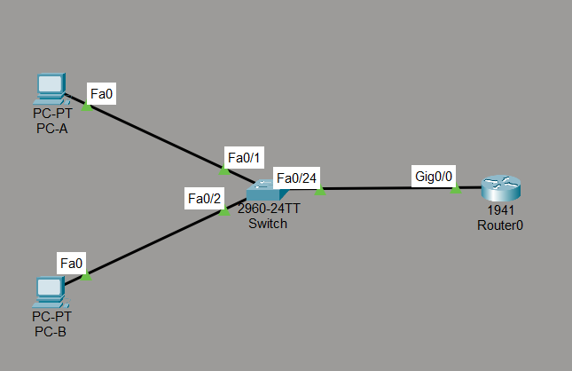
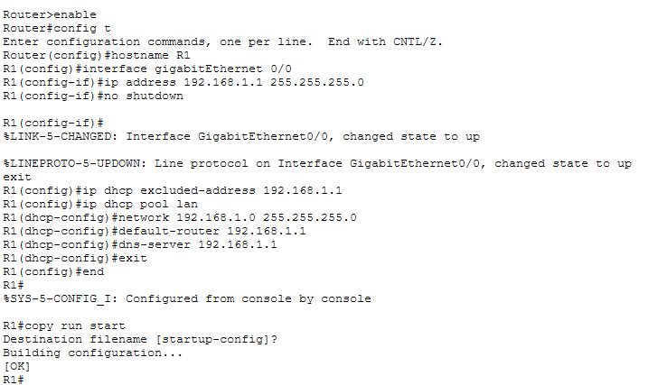
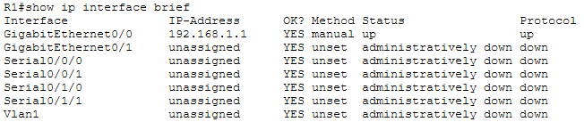
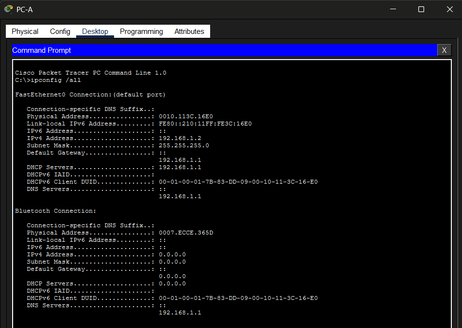
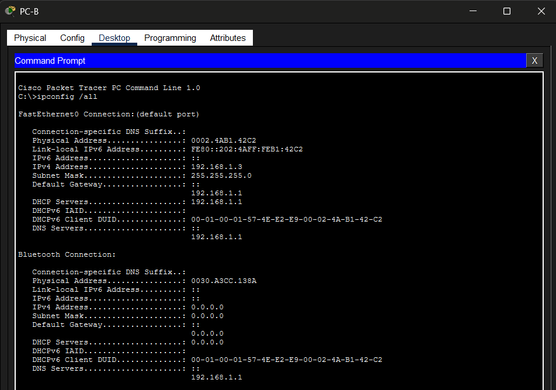
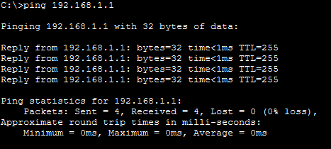
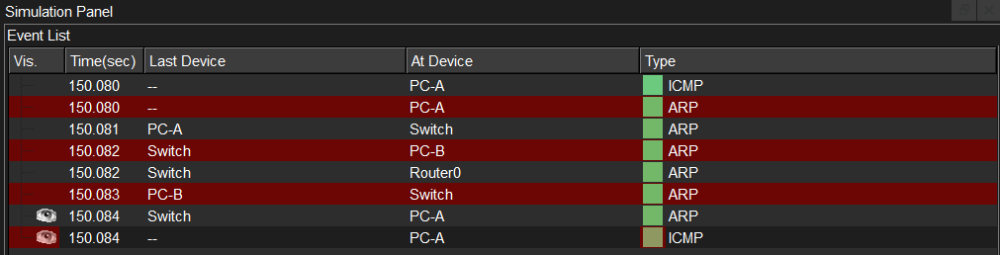

# Lab 01 — LAN Setup with Router Configuration and DHCP

**Course:** CST8108 – Network Programming Basics (Algonquin College)
**Tools:** Cisco Packet Tracer · Cisco IOS
**Skills:** Ethernet cabling · Cisco IOS CLI · DHCP configuration · IPv4 addressing · LAN configuration · ICMP connectivity testing · Packet Tracer simulation

> **Note:** This lab was originally performed on physical equipment in the networking lab. It has been recreated in Cisco Packet Tracer to provide a reproducible, shareable environment while preserving the original topology, configuration, and verification steps. Differences between the physical setup and the Packet Tracer recreation are noted where relevant.

## Objective

Build a small switched LAN using a Cisco router and switch, configure the router as the default gateway and DHCP server, obtain IP addresses dynamically on both hosts, and verify end-to-end connectivity using Cisco IOS and Packet Tracer.

## Topology

  

Two PCs connect to a 2960 switch, which uplinks to a 1941 router on GigabitEthernet0/0. The router serves as the gateway and DHCP server for 192.168.1.0/24, allowing both hosts to obtain IPv4 addresses dynamically through DHCP. All links use copper straight-through cable, since PC–switch and switch–router are connections between unlike devices.

## Router configuration (IOS CLI)

Configured `GigabitEthernet0/0` as the LAN gateway and created a DHCP pool to automatically assign IPv4 addresses to client devices.

  

Verified the interface is up and correctly addressed with `show ip interface brief`:

  

`GigabitEthernet0/0` shows `192.168.1.1`, status **up / up**.

## DHCP addressing

Both PCs were set to DHCP and pulled addresses from the router's pool. The router reserves `192.168.1.1` for the gateway interface, so DHCP leases begin at `192.168.1.2`.

**PC-A** → 192.168.1.2, gateway/DHCP server 192.168.1.1

  

**PC-B** → 192.168.1.3, gateway/DHCP server 192.168.1.1

  

## Connectivity verification

Connectivity was verified by successfully pinging the default gateway from PC-A with 0% packet loss.

  

## Traffic flow analysis

Packet Tracer Simulation mode confirmed that ARP resolved the destination MAC address before the ICMP Echo Request and Echo Reply were exchanged.

  

This ARP-before-ICMP sequence confirms that Layer 2 address resolution precedes Layer 3 ping traffic.

## Files

- [`LAN-Setup-Router-DHCP.pkt`](LAN-Setup-Router-DHCP.pkt) — open in Packet Tracer to inspect or reproduce.

## What I learned

- Configuring a Cisco router interface and a DHCP pool via IOS CLI.
- Why PC–switch–router links use straight-through cabling.
- How a host uses ARP to resolve a MAC address before ICMP traffic flows.
- Verifying a network with `show ip interface brief`, `ipconfig /all`, and `ping`.