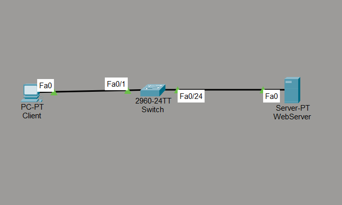
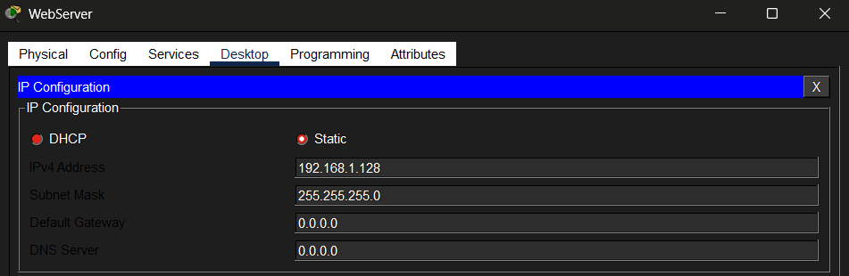
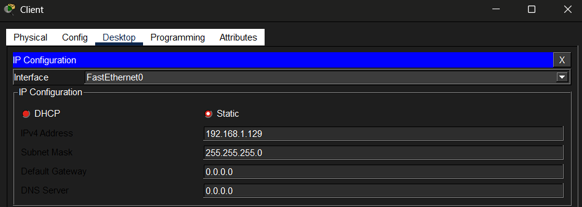
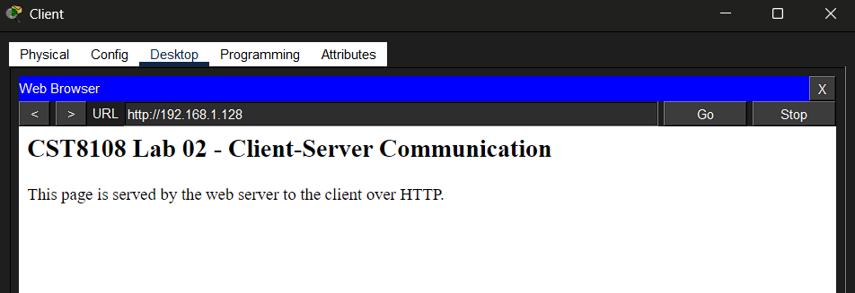
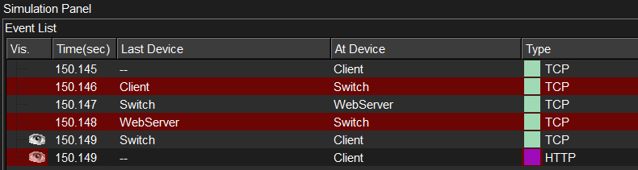
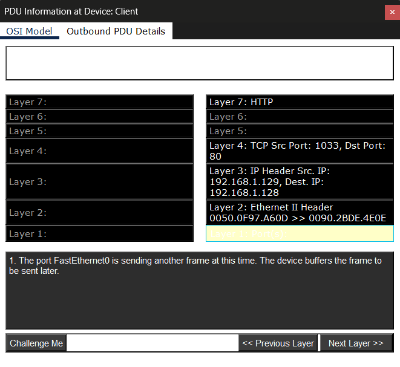

# Lab 02 — Client–Server Communication and HTTP Packet Analysis

**Course:** CST8108 – Network Programming Basics (Algonquin College)
**Tools:** Cisco Packet Tracer · Cisco IOS
**Skills:** Client–server networking · HTTP · TCP/IP · static IPv4 addressing · web server configuration · packet capture · protocol layer analysis

> **Note:** This lab was originally performed on physical equipment in the networking lab. It has been recreated in Cisco Packet Tracer to provide a reproducible, shareable environment while preserving the original topology, configuration, and verification steps. Differences between the physical setup and the Packet Tracer recreation are noted where relevant.

## Objective

Configure a web server and client on a switched LAN, serve a web page over HTTP, and capture the exchange to analyze how the request travels through the TCP/IP protocol stack.

## Topology

  

A client PC and a web server connect through a 2960 switch on the 192.168.1.0/24 network. Both hosts use static IPv4 addressing, and all links use copper straight-through cable since PC–switch and switch–server are connections between unlike devices.

## Addressing

Static IPv4 addresses were assigned to both hosts on the same subnet.

**Web Server** → 192.168.1.128 / 255.255.255.0

  

**Client** → 192.168.1.129 / 255.255.255.0

  

## Client–server communication

The server's HTTP service hosts a web page. From the client's web browser, requesting `http://192.168.1.128` successfully loads the page served over HTTP, confirming end-to-end client–server communication.

  

> **Physical vs. recreation:** On the physical equipment, the page was served by a PHP script (`index.php`) that dynamically displayed the client and server IP addresses. Packet Tracer's HTTP service serves static HTML only and cannot execute PHP, so this recreation uses a static page. The dynamic address behaviour was demonstrated on the physical server.

## Traffic flow analysis

Using Packet Tracer's Simulation mode, the capture shows the TCP connection being established first (the three-way handshake), followed by the HTTP request. This confirms that HTTP operates over TCP — the transport connection must be in place before any application data is exchanged.

  

## Protocol layer analysis

> **Note on packet analysis:** In the physical lab, the HTTP exchange was captured and analyzed using Wireshark. Because real captures expose hardware MAC addresses and other identifying details of lab devices, the analysis shown here uses Packet Tracer's PDU (OSI Model) view instead, which presents the same protocol-layer breakdown without revealing that information.

Inspecting the HTTP packet's PDU shows the full protocol stack:

- **Layer 7 – HTTP** (application)
- **Layer 4 – TCP**, destination port **80** (the web server)
- **Layer 3 – IP**, source 192.168.1.129 (client) → destination 192.168.1.128 (server)
- **Layer 2 – Ethernet II**, with source and destination MAC addresses

  

## Files

- [`Client-Server-HTTP.pkt`](Client-Server-HTTP.pkt) — open in Packet Tracer to inspect or reproduce.

## What I learned

- Configuring a web server's HTTP service and serving a page to a client.
- Why HTTP depends on an established TCP connection (handshake before data).
- Reading a packet layer by layer to identify the protocol at each OSI level.
- How Packet Tracer's static HTTP service differs from a real PHP-capable server.