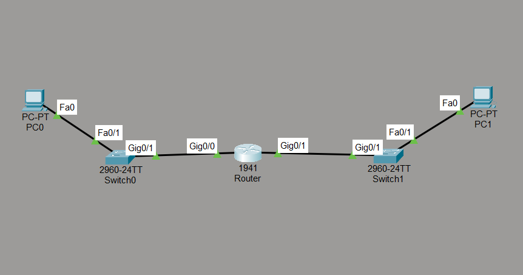
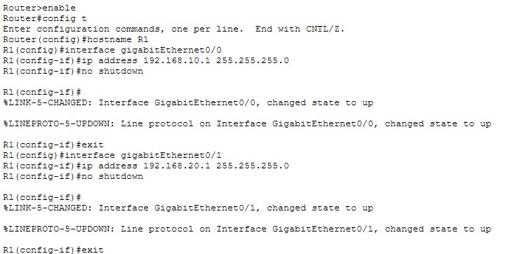
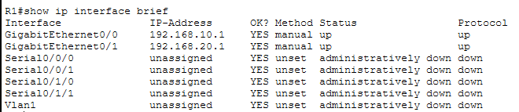
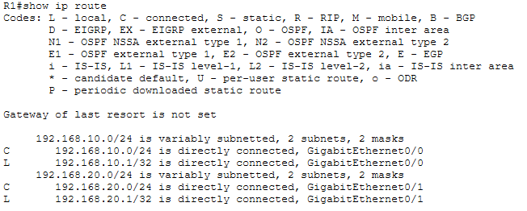
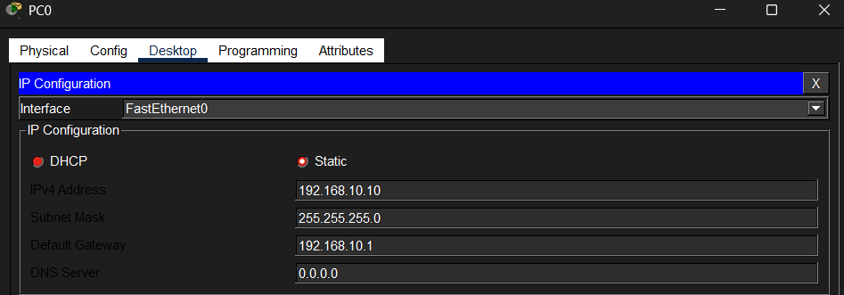
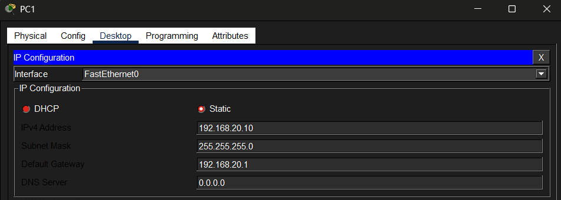
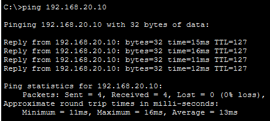
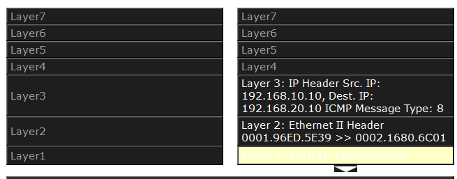

# Lab 03 — Router Configuration and Inter-Subnet Routing

**Course:** CST8108 – Network Programming Basics (Algonquin College)
**Tools:** Cisco Packet Tracer · Cisco IOS
**Skills:** Router configuration · inter-subnet routing · Cisco IOS CLI · IPv4 subnetting · static IP addressing · routing table analysis · ARP and gateway behaviour · connectivity verification

> **Note:** This lab was originally performed on physical equipment in the Algonquin College networking lab. It has been recreated in Cisco Packet Tracer to provide a reproducible, shareable environment while preserving the original topology, configuration, and verification steps. Differences between the physical setup and the Packet Tracer recreation are noted where relevant.

## Objective

Configure a Cisco router to connect two separate subnets, assign a gateway interface to each, and verify that hosts on different subnets can communicate through the router. Analyze how a frame is addressed when traffic crosses a subnet boundary.

## Topology

  

Two subnets are connected through a single 1941 router:

- **Subnet A** — `192.168.10.0/24`, with PC0 connected via Switch0 to router interface GigabitEthernet0/0.
- **Subnet B** — `192.168.20.0/24`, with PC1 connected via Switch1 to router interface GigabitEthernet0/1.

Each router interface serves as the default gateway for its subnet. All links use copper straight-through cable.

## Router configuration (IOS CLI)

Each interface was assigned an IP address on its respective subnet and enabled. Because both subnets are directly connected to the router, no additional routing protocol is required — the router routes between them automatically.

  

Both interfaces confirmed up with `show ip interface brief`:

  

`GigabitEthernet0/0` (192.168.10.1) and `GigabitEthernet0/1` (192.168.20.1) both show status **up / up**.

## Routing table

The router's routing table shows both subnets as directly connected (`C`), confirming the router knows how to reach each network:

  

## Host addressing

Each host is configured on its own subnet, pointing to that subnet's router interface as its default gateway.

**PC0** → 192.168.10.10 / 255.255.255.0, gateway 192.168.10.1

  

**PC1** → 192.168.20.10 / 255.255.255.0, gateway 192.168.20.1

  

## Connectivity verification

Pinging PC1 (192.168.20.10) from PC0 (192.168.10.10) succeeds with 0% packet loss, confirming successful communication between the two subnets. The replies show **TTL 127** — decremented from 128 by the router, which itself confirms the traffic was routed across one hop.

  

## Protocol layer analysis

Inspecting the ICMP packet as it leaves PC0 reveals how addressing works across a subnet boundary:

  

- **Layer 3 (IP)** — destination `192.168.20.10`: the **final host** on the remote subnet.
- **Layer 2 (Ethernet)** — destination MAC is the **router's gateway interface**, not PC1's MAC.

This confirms a key routing concept: when a host sends traffic to a different subnet, the frame is addressed at Layer 2 to the **default gateway**, because the destination host is not directly reachable on the local network. The router then forwards the packet toward its final destination.

> **Note on packet analysis:** In the physical lab, this cross-subnet traffic was captured and analyzed using Wireshark. Because real captures expose hardware MAC addresses and other identifying details of lab devices, the analysis shown here uses Packet Tracer's PDU (OSI Model) view instead, which presents the same protocol-layer breakdown without revealing that information.

> **Physical vs. recreation:** On the physical equipment, the router was configured through its web management interface (browser-based GUI, factory reset). This recreation configures an equivalent Cisco 1941 router through the IOS command-line interface, demonstrating the same inter-subnet routing outcome using CLI configuration.

## Files

- [`Router-Inter-Subnet-Routing.pkt`](Router-Inter-Subnet-Routing.pkt) — open in Packet Tracer to inspect or reproduce.

## What I learned

- Configuring multiple router interfaces to connect separate subnets.
- How a router routes between directly connected networks without extra configuration.
- Reading a routing table to confirm known networks.
- Why cross-subnet frames are addressed at Layer 2 to the default gateway rather than the destination host.
- Confirming routing with `show ip route`, `show ip interface brief`, and cross-subnet `ping` (including the TTL decrement).