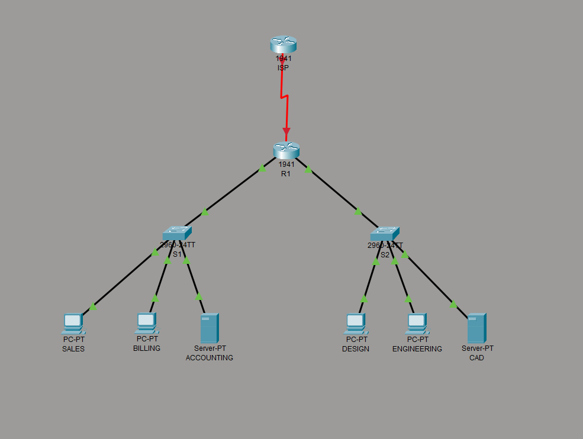
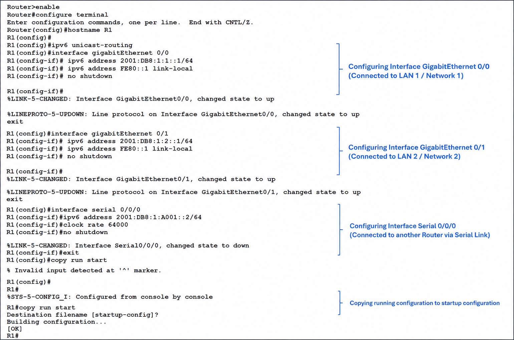
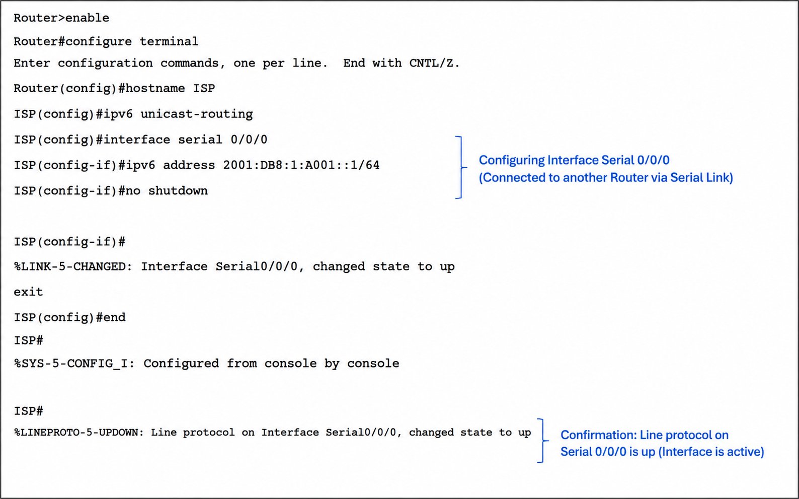
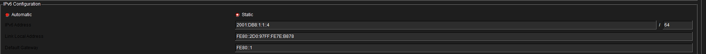
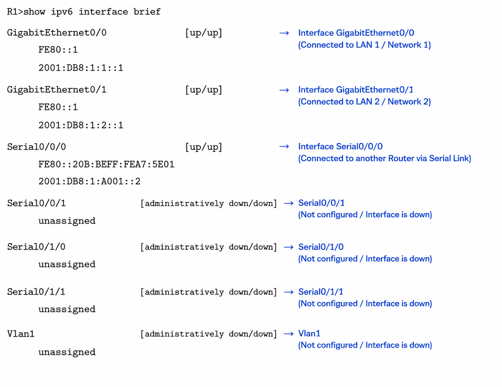
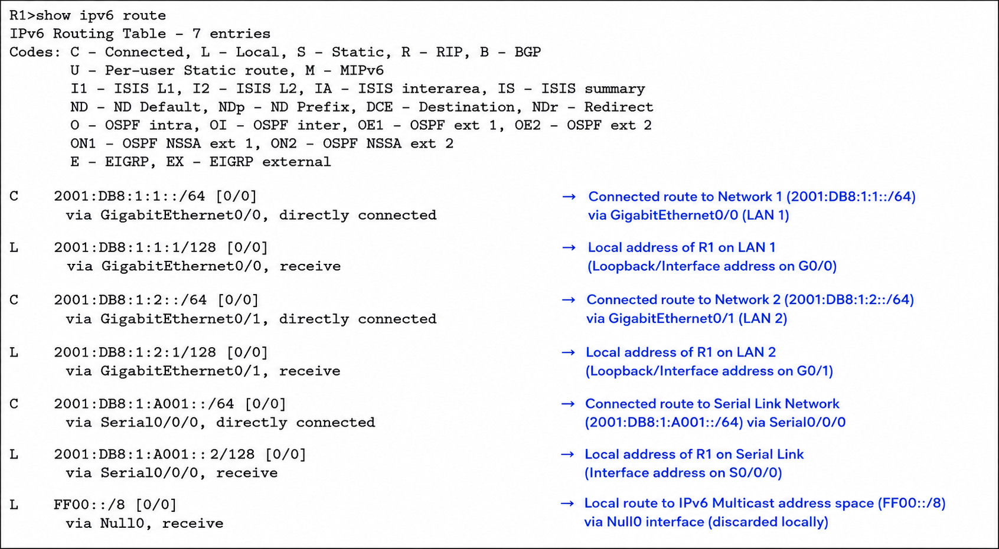
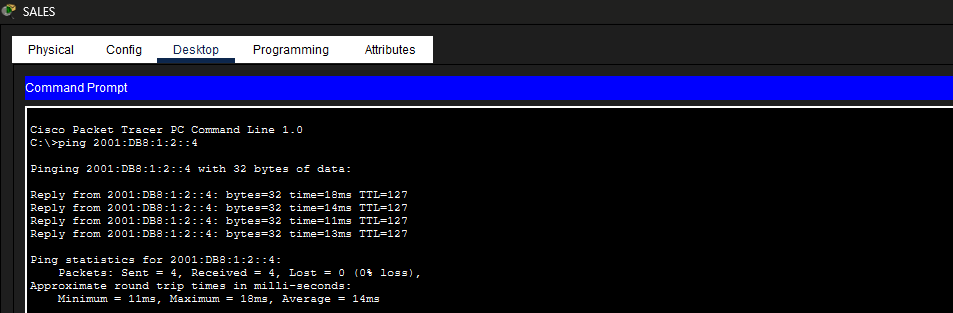
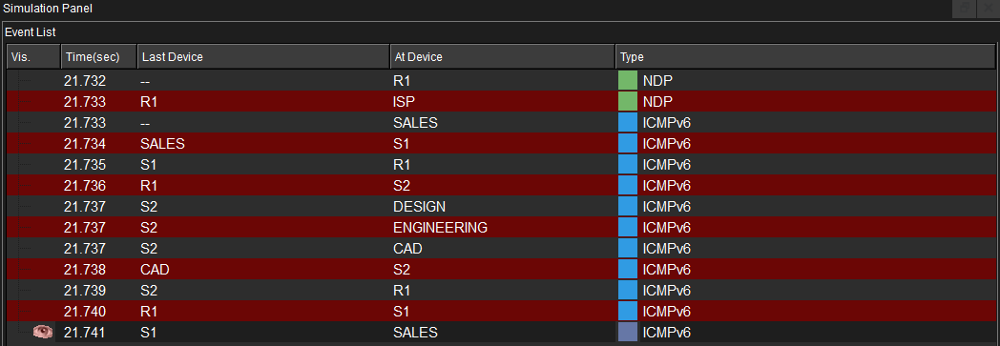
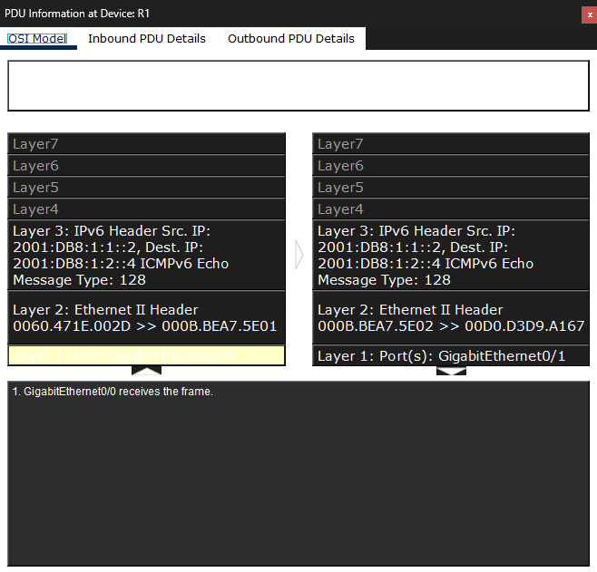

# Lab 04 — Configuring IPv6 Addressing

**Course:** CST8108 – Network Programming Basics (Algonquin College)
**Tools:** Cisco Packet Tracer · Cisco IOS
**Skills:** IPv6 addressing · IPv6 subnetting · Cisco IOS CLI · IPv6 routing (`ipv6 unicast-routing`) · link-local addressing · Neighbor Discovery Protocol (NDP) · connectivity verification

> **Note:** This lab was completed as a Cisco Packet Tracer activity. It configures IPv6 addressing across a multi-subnet network and verifies end-to-end connectivity, including analysis of how IPv6 traffic is forwarded between subnets.

## Objective

Configure IPv6 addressing on a router, servers, and clients across two LANs and a WAN link, enable IPv6 routing, and verify connectivity between subnets. Analyze how IPv6 forwards traffic and how it differs from IPv4 at the packet level.

## Topology

  

A single router (R1) connects two LANs and a WAN link to an ISP:

- **LAN 1** — `2001:DB8:1:1::/64` (Sales, Billing, Accounting) on R1 G0/0
- **LAN 2** — `2001:DB8:1:2::/64` (Design, Engineering, CAD) on R1 G0/1
- **WAN link** — `2001:DB8:1:A001::/64` between R1 (S0/0/0) and the ISP router

R1's link-local address `FE80::1` serves as the default gateway for all hosts.

## Router configuration (IOS CLI)

Each interface was assigned a global IPv6 address and a link-local address, and `ipv6 unicast-routing` was enabled so the router forwards IPv6 packets between subnets.

  

The ISP router was configured on the WAN link to provide an external destination for connectivity testing.

  

## Host configuration

Each host was assigned a static IPv6 address on its subnet, with the router's **link-local** address (`FE80::1`) as the default gateway. In IPv6, hosts use the router's link-local address as their gateway — not its global address — while each host keeps its own automatically generated link-local address.

  

## Verification

Both LAN interfaces and the WAN link are up with their IPv6 addresses:

  

The IPv6 routing table shows all three networks as directly connected:

  

A ping from a LAN 1 host to a LAN 2 host succeeds, confirming inter-subnet IPv6 connectivity:

  

## Traffic flow analysis

In Simulation mode, the cross-subnet exchange shows the router resolving the next hop with **NDP (Neighbor Discovery Protocol)** before the **ICMPv6** echo is forwarded across the network. NDP is IPv6's replacement for ARP.

  

## Protocol layer analysis

Inspecting the ICMPv6 packet at R1 shows both the inbound and outbound frames as the router forwards it:

  

- **Layer 3 (IPv6)** stays constant end to end: source `2001:DB8:1:1::2` → destination `2001:DB8:1:2::4` (ICMPv6 Echo, Type 128). The IP addresses identify the original sender and the final host.
- **Layer 2 (Ethernet)** is **rewritten by the router**: the inbound frame is addressed to R1's G0/0 MAC (the gateway), and R1 forwards a new frame sourced from its G0/1 MAC to the destination host's MAC.

This demonstrates the core of routing: Layer 3 addressing is end-to-end, while Layer 2 addressing is rewritten hop by hop as the packet crosses the router.

## Files

- [`IPv6-Addressing.pkt`](IPv6-Addressing.pkt) — open in Packet Tracer to inspect or reproduce.

## What I learned

- Configuring global and link-local IPv6 addresses on router interfaces.
- Why `ipv6 unicast-routing` is required for a router to forward IPv6 between subnets.
- That IPv6 hosts use the router's **link-local** address as their default gateway, while each host needs its own unique link-local address.
- How IPv6 uses **NDP/ICMPv6** for neighbor resolution instead of ARP.
- How a router keeps Layer 3 addressing constant end to end while rewriting the Layer 2 header at each hop.