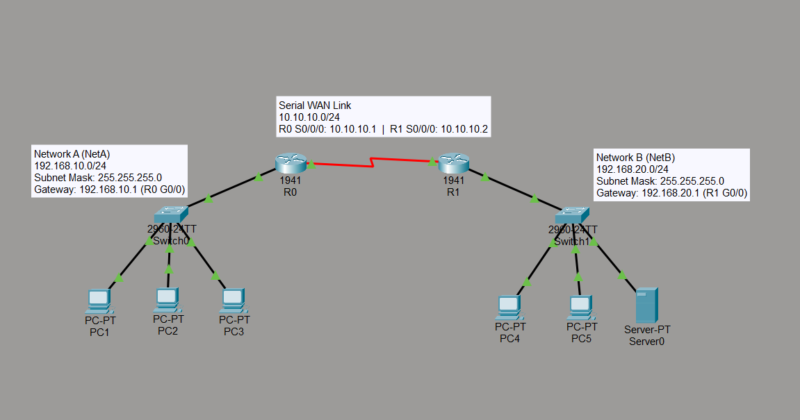
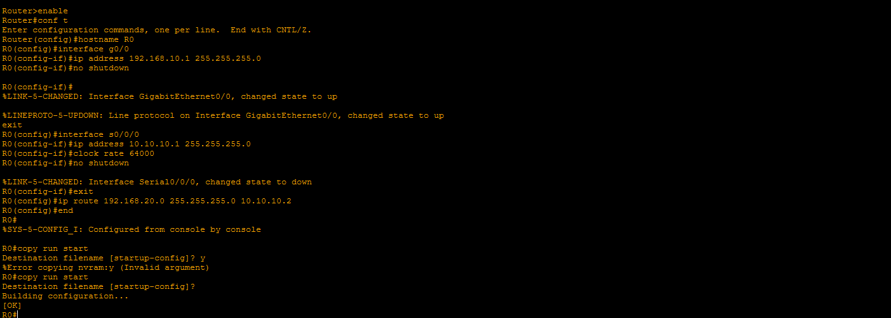
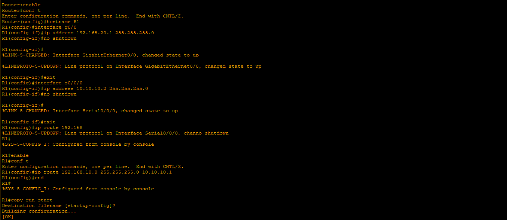
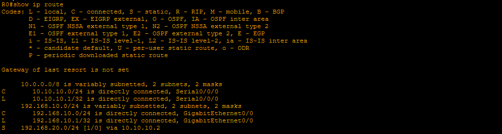
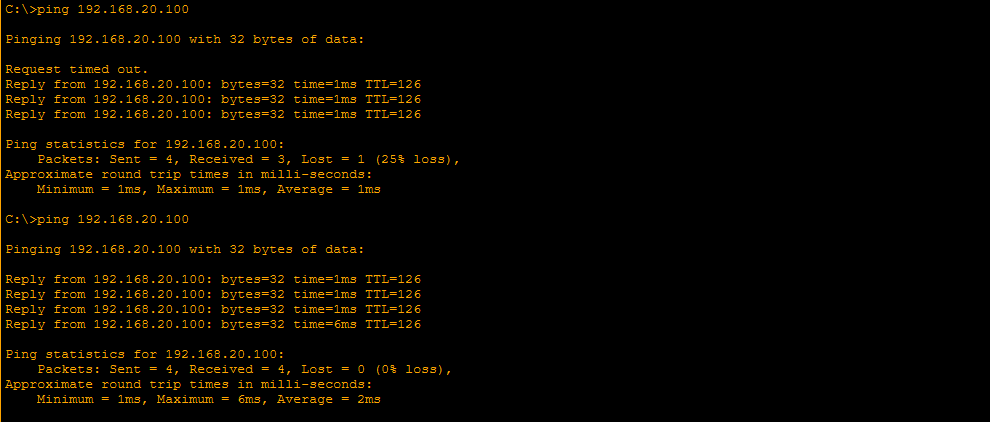
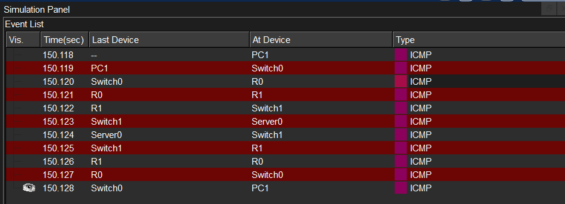
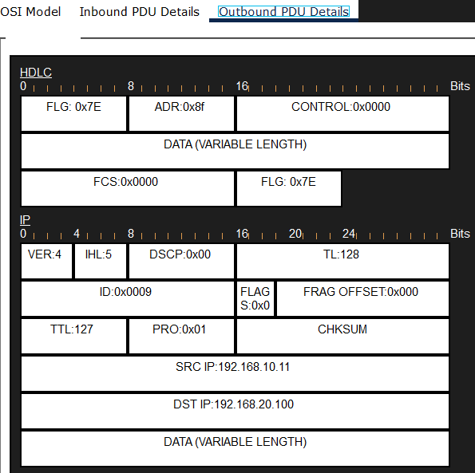

# Lab 05 — Static Routing and TTL Verification

**Course:** CST8108 – Network Programming Basics (Algonquin College)
**Tools:** Cisco Packet Tracer · Cisco IOS
**Skills:** Static routing · Cisco IOS CLI · IPv4 addressing · WAN serial links · routing table analysis · TTL and packet forwarding · connectivity verification

> **Note:** This lab was originally performed on physical equipment in the Algonquin College networking lab. It has been recreated in Cisco Packet Tracer to provide a reproducible, shareable environment while preserving the original topology, configuration, and verification steps. Differences between the physical setup and the Packet Tracer recreation are noted where relevant.

## Objective

Connect two separate LANs through two routers joined by a serial WAN link, configure static routes so each router can reach the network behind the other, and verify end-to-end connectivity. Examine how the TTL field decrements as packets are forwarded across routers.

## Topology

  

Two LANs are connected through two routers over a serial WAN link. Because each router is only directly connected to its own LAN and the serial link, a static route is required on each router to reach the LAN behind the other.

## Addressing Table

| Device | Interface | IP Address | Subnet Mask | Default Gateway |
| :--- | :--- | :--- | :--- | :--- |
| **R0** | G0/0 | 192.168.10.1 | 255.255.255.0 | — |
| **R0** | S0/0/0 | 10.10.10.1 | 255.255.255.0 | — |
| **R1** | G0/0 | 192.168.20.1 | 255.255.255.0 | — |
| **R1** | S0/0/0 | 10.10.10.2 | 255.255.255.0 | — |
| **Network A hosts** | NIC | 192.168.10.11 – .13 | 255.255.255.0 | 192.168.10.1 |
| **Network B hosts** | NIC | 192.168.20.11 – .12 | 255.255.255.0 | 192.168.20.1 |
| **Server (Network B)** | NIC | 192.168.20.100 | 255.255.255.0 | 192.168.20.1 |

## Router configuration (IOS CLI)

Each router's interfaces were addressed and enabled, and a static route was added pointing to the remote network via the other router's serial interface.

**R0** — static route to Network B (`192.168.20.0/24`) via next hop `10.10.10.2`:

  

**R1** — static route to Network A (`192.168.10.0/24`) via next hop `10.10.10.1`:

  

Each router's static route points to the network it is *not* directly connected to — the one behind the other router.

## Routing table

R0's routing table shows the static route (`S`) to the remote network alongside the directly connected (`C`) routes:

  

The `S` entry is the manually configured route; without it, R0 would have no way to reach Network B.

## Connectivity verification

A ping from a host on Network A to the server on Network B succeeds across both routers:

  

The replies arrive with **TTL 126** — decremented from 128 by the two router hops on the return path, confirming the traffic was routed across both routers rather than delivered locally.

## Traffic flow analysis

In Simulation mode, the ICMP exchange travels from the host on Network A, across both routers, to the server on Network B, and back:

  

Inspecting the packet's outbound PDU at a router shows the **TTL field decremented from 128 to 127** as the router forwards it. The Layer 2 header on the serial link uses **HDLC** encapsulation (the WAN protocol on the router-to-router link), rather than the Ethernet framing used on the LANs:

  

This demonstrates that each router decrements the TTL by one as it forwards a packet — the mechanism that prevents packets from looping endlessly through a network.

## Files

- [`Static-Routing.pkt`](Static-Routing.pkt) — open in Packet Tracer to inspect or reproduce.

## What I learned

- Configuring static routes so a router can reach a network it is not directly connected to.
- That each router's static route points to the remote network via the other router's nearest interface.
- Reading a routing table to distinguish static (`S`) from directly connected (`C`) routes.
- How the TTL field decrements by one at each router hop, and why (loop prevention).
- That serial WAN links use HDLC encapsulation while LANs use Ethernet.